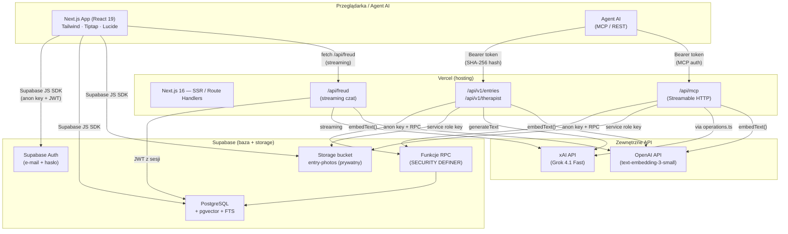

# Architektura systemu Echo

## 1. Przegląd systemu

Echo to osobisty dziennik webowy z wbudowanym psychoterapeutą AI. Użytkownik loguje się (e-mail + hasło), pisze wpisy tekstowe z opcjonalnymi zdjęciami, przegląda je w kalendarzu, a następnie analizuje je z cyfrowym terapeutą opartym na modelu xAI Grok. System udostępnia publiczne REST API i zdalny serwer MCP, dzięki czemu agenci AI mogą dodawać wpisy i rozmawiać z terapeutą programowo. Wyszukiwanie wpisów jest hybrydowe — łączy pełnotekstowe FTS (PostgreSQL `tsvector`) z wyszukiwaniem wektorowym (OpenAI `text-embedding-3-small` + pgvector HNSW) i scala wyniki algorytmem RRF.

## 2. Diagram architektury



## 3. Komponenty

### 3.1 Frontend (Next.js App Router)

| Strona | Ścieżka | Odpowiedzialność |
|--------|---------|------------------|
| Write | `/write` | Tworzenie/edycja wpisu — edytor Tiptap, upload zdjęć z kompresją kliencką, dyktowanie (Web Speech API) |
| Calendar | `/calendar` | Kalendarz aktywności z kropkami photo-dot, lista wpisów dnia, przycisk „Analizuj z AI" |
| Entry detail | `/entries/[id]` | Podgląd wpisu — galeria zdjęć (snap-scroll), sanityzacja HTML (DOMPurify), usuwanie |
| AI (Freud) | `/ai` | Czat z psychoterapeutą — streaming przez Vercel AI SDK, auto-start analizy, historia rozmów |
| Login | `/login` | Rejestracja i logowanie (Supabase Auth) |
| Profile | `/profile` | E-mail, wylogowanie |
| Docs | `/docs` | Dokumentacja REST API + MCP — publiczna (bez logowania) |

### 3.2 Warstwa API (Route Handlers)

| Endpoint | Metody | Autentykacja | Opis |
|----------|--------|-------------|------|
| `/api/v1/entries` | GET, POST | Bearer token (SHA-256 → RPC) | CRUD wpisów z opcjonalnymi zdjęciami (data URL base64) |
| `/api/v1/therapist` | POST | Bearer token | Pytanie do terapeuty — odpowiedź JSON (nie streaming) |
| `/api/freud` | POST | JWT sesji (w body) | Wewnętrzny endpoint czatu — streaming (Vercel AI SDK) |
| `/api/mcp` | GET, POST, DELETE | Bearer token (MCP auth) | Zdalny serwer MCP (Streamable HTTP) — 3 narzędzia |

### 3.3 Biblioteki (`lib/`)

| Moduł | Plik | Rola |
|-------|------|------|
| Supabase client | `supabase.ts` | Klient przeglądarkowy (anon key) |
| Env | `env.ts` | Czyszczenie zmiennych środowiskowych (BOM, whitespace) |
| Storage | `storage.ts` | CRUD wpisów i rozmów AI (klient Supabase) |
| Photos | `photos.ts` | Upload/podpisane URL/usuwanie zdjęć (klient), kompresja Canvas API (max 1920px, JPEG 0.82) |
| API server | `api/server.ts` | Hashowanie tokenów, CORS (whitelist), JSON responses, `plainTextToHtml` (z escape) |
| API operations | `api/operations.ts` | Logika biznesowa współdzielona przez REST i MCP — `addEntry`, `getEntriesByDate`, `askTherapist` |
| Server storage | `api/server-storage.ts` | Upload zdjęć server-side (service role key), limit 10 MB/plik |
| Freud | `freud.ts` | Persona terapeuty, budowanie kontekstu (wpisy dnia + tło + powiązane), `htmlToPlainText` |
| Embeddings | `embeddings.ts` | OpenAI `text-embedding-3-small` — `embedText()`, `embedBatch()`, `toVectorLiteral()` |
| API Keys | `apiKeys.ts` | Zarządzanie kluczami API per user (tworzenie, listowanie, usuwanie) — klient |
| Types | `types.ts` | Interface `Entry` (id, date, content, photoUrl?, photoPaths?) |

### 3.4 Komponenty UI (`components/`)

| Komponent | Rola |
|-----------|------|
| `AuthProvider` | Context sesji Supabase, redirect niezalogowanych |
| `MobileNav` | Hamburger menu + header (mobile), sidebar (desktop) |
| `Sidebar` | Nawigacja boczna desktop |
| `ActivityCalendar` | Kalendarz miesiąca z oznaczeniem wpisów (fiolet), zdjęć (biała kropka), streak |
| `EntryEditor` | Edytor Tiptap (bold, italic, strike, heading, listy) |
| `VoiceRecorder` | Nagrywanie głosu → transkrypcja (Web Speech API) |
| `ApiKeysManager` | Tworzenie/usuwanie kluczy API (strona profilu i docs) |

## 4. Źródła danych

### 4.1 PostgreSQL (Supabase) — schemat `public`

| Tabela | Kolumny kluczowe | RLS | Opis |
|--------|-----------------|-----|------|
| `entries` (241 wierszy) | `id` uuid PK, `user_id` uuid FK→auth.users, `date` timestamptz, `content` text (HTML), `content_text` text, `embedding` vector(1536), `fts` tsvector (generated), `photo_url` text (legacy), `photo_paths` text[] | Tak | Wpisy dziennika |
| `ai_conversations` (13) | `id` uuid PK, `user_id` FK, `entry_id` FK→entries (nullable), `mode` ('entry' \| 'general') | Tak | Sesje rozmów z terapeutą |
| `ai_messages` (30) | `id` uuid PK, `conversation_id` FK, `user_id` FK, `role` ('user' \| 'assistant'), `content` text | Tak | Wiadomości w rozmowach |
| `api_keys` (1) | `id` uuid PK, `user_id` FK, `token_hash` text UNIQUE, `prefix` text, `label` text | Tak | Klucze API per user (hash SHA-256) |

**Indeksy i wyszukiwanie:**
- `embedding` — pgvector HNSW (cosine similarity)
- `fts` — `tsvector` generowany z `content_text` przez `immutable_unaccent`
- Wyszukiwanie hybrydowe: FTS + wektor → RRF (Reciprocal Rank Fusion) w funkcji RPC `search_entries` / `api_search_entries`

**Funkcje RPC (SECURITY DEFINER):**
- `api_add_entry` — wstawia wpis z walidacją tokenu
- `api_get_entries_by_date` — pobiera wpisy dnia
- `api_therapist_context` — wpisy dnia + tło 30 dni
- `api_search_entries` — wyszukiwanie hybrydowe (token-based)
- `api_whoami` — resolves token_hash → user_id
- `search_entries` — wyszukiwanie hybrydowe (auth.uid()-based)
- `api_get_entry_photo_paths` — ścieżki zdjęć wpisu

### 4.2 Supabase Storage

| Bucket | Typ | RLS | Opis |
|--------|-----|-----|------|
| `entry-photos` | Prywatny | Tak — `auth.uid()::text = (storage.foldername(name))[1]` | Zdjęcia wpisów, folder per user |

Dostęp: signed URL z TTL 1h (klient), service role key (API server-side upload).

## 5. Integracje i połączenia

### 5.1 Zewnętrzne API

| Serwis | Kierunek | Cel | Autentykacja |
|--------|----------|-----|-------------|
| xAI (Grok 4.1 Fast Reasoning) | OUT | Generowanie odpowiedzi terapeuty (streaming + jednorazowe) | Bearer `XAI_API_KEY` |
| OpenAI | OUT | Embeddingi `text-embedding-3-small` (1536 dim) — zapytania użytkownika | Bearer `OPENAI_API_KEY` |
| Supabase | IN/OUT | Auth, baza, storage | Anon key (klient), service role key (server) |

### 5.2 Serwer MCP

Endpoint: `/api/mcp` (Streamable HTTP, biblioteka `mcp-handler`).

| Narzędzie | Opis |
|-----------|------|
| `echo_add_entry` | Dodaje wpis (tekst + opcjonalne zdjęcia base64, max 10) |
| `echo_get_entry` | Odczytuje wpisy z danego dnia |
| `echo_ask_therapist` | Wysyła pytanie do terapeuty z kontekstem wpisów |

Autentykacja MCP: ten sam Bearer token co REST API → weryfikacja przez `api_whoami` RPC.

### 5.3 Claude Code Skill

Skill `echo-add-entry` (`skill-echo-mobilny/SKILL.md`) — loguje się do konta Echo przez Supabase REST i dodaje wpis programowo.

## 6. Przepływ danych

### 6.1 Zapisanie wpisu (przeglądarka)

```
Użytkownik → Tiptap editor → handleSave()
  → [kompresja zdjęć: Canvas API, max 1920px, JPEG 0.82]
  → uploadPhoto() → Supabase Storage (bucket entry-photos/{userId}/...)
  → saveEntry() → Supabase DB (tabela entries, upsert)
  → redirect → /calendar
```

### 6.2 Zapisanie wpisu (API / MCP)

```
Agent → POST /api/v1/entries (lub echo_add_entry MCP)
  → requireToken() → hashToken(SHA-256)
  → [opcjonalnie: dekoduj base64 zdjęcia → walidacja ≤10 MB → upload service role key]
  → plainTextToHtml() z escape HTML
  → db.rpc("api_add_entry", { p_token_hash, p_content, p_photo_paths, ... })
  → SECURITY DEFINER: walidacja tokenu → INSERT entries
  → 201 JSON
```

### 6.3 Rozmowa z terapeutą (czat)

```
Użytkownik → /ai → send()
  → getEntries() → computeContext(dayEntries, recentEntries)
  → embedText(query) → OpenAI embeddings
  → search_entries(FTS + vector, RRF) → relevantEntries
  → buildContextBlock(dayEntries, recentEntries, relevantEntries)
  → POST /api/freud → xAI Grok 4.1 Fast (streaming)
  → streamText → toUIMessageStreamResponse (bez reasoning)
  → appendMessage() → ai_messages (persystencja)
```

### 6.4 Wyszukiwanie hybrydowe

```
Zapytanie użytkownika
  → embedText() → wektor 1536-dim (OpenAI)
  → RPC search_entries / api_search_entries:
      1. FTS: to_tsquery('simple', unaccent(query)) → ranking ts_rank
      2. Vector: cosine similarity (pgvector HNSW) → ranking 1-distance
      3. RRF: 1/(60+rank_fts) + 1/(60+rank_vec) → posortowane wyniki
  → top 8 → kontekst dla terapeuty
```

## 7. Hosting i deployment

| Element | Platforma | Szczegóły |
|---------|-----------|-----------|
| Aplikacja Next.js | **Vercel** | Projekt `echo`, URL: `https://echo-dziennik.vercel.app`, auto-deploy z `main` |
| Baza danych | **Supabase** | Projekt `hiyzcmmiwpfdgpkmdrru`, region `[do weryfikacji]` |
| Storage | **Supabase Storage** | Bucket `entry-photos` (prywatny, RLS) |
| Auth | **Supabase Auth** | E-mail + hasło |
| DNS/CDN | Vercel Edge Network | Automatyczny HTTPS |

### Zmienne środowiskowe

| Zmienna | Rola | Gdzie używana |
|---------|------|---------------|
| `NEXT_PUBLIC_SUPABASE_URL` | URL instancji Supabase | Klient + serwer |
| `NEXT_PUBLIC_SUPABASE_ANON_KEY` | Klucz publiczny (anon) — podlega RLS | Klient + serwer (RPC) |
| `SUPABASE_SECRET_KEY` | Service role key — omija RLS | Serwer (upload zdjęć z API) |
| `XAI_API_KEY` | Klucz xAI (Grok) | Serwer (terapeuta) |
| `OPENAI_API_KEY` | Klucz OpenAI (embeddingi) | Serwer (wyszukiwanie) |
| `NEXT_PUBLIC_SITE_URL` | Opcjonalny URL produkcyjny (CORS whitelist) | Serwer |

### Uruchamianie lokalne

```bash
cd echo
npm install
npm run dev        # → http://localhost:3000 (Turbopack)
```

Brak Dockera, crona ani tmux — aplikacja jest bezstanowa (Vercel serverless).

## 8. Otwarte pytania / TODO

- **Region Supabase** — nie udało się ustalić z plików konfiguracyjnych `[do weryfikacji]`
- **Rate-limiting** — brak ochrony przed nadużyciami na endpointach API (brute-force tokenów, koszty xAI/OpenAI)
- **Rotacja kluczy** — sekrety (`XAI_API_KEY`, `OPENAI_API_KEY`, `SUPABASE_SECRET_KEY`) powinny zostać zrotowane (były widoczne w kontekście konwersacji)
- **Session token w `/api/freud`** — JWT przesyłany w body bez niezależnej weryfikacji server-side; potencjalne podszycie się pod innego użytkownika w wyszukiwaniu
- **Backup/retention** — brak widocznej konfiguracji backupów bazy; Supabase oferuje automatyczne, ale policy nie jest udokumentowana
- **Testy** — brak testów jednostkowych i integracyjnych w repozytorium
- **Migracje** — pliki migracji nie są przechowywane lokalnie (stosowane bezpośrednio przez Supabase MCP/dashboard)
